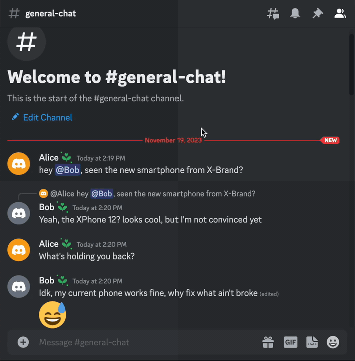
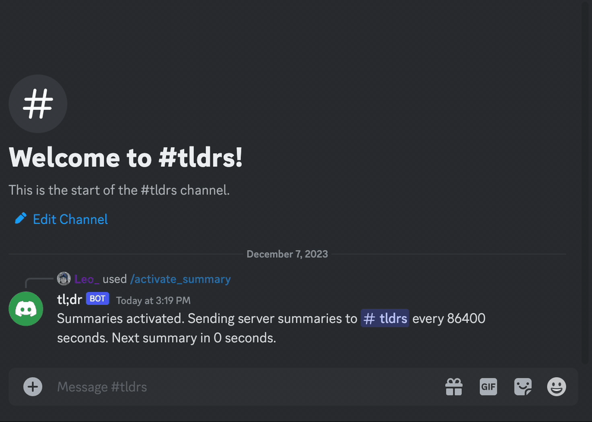

# discord-bot-tldr

Summarize conversations that you don't have time to read.

## Features

### `/tldr`



`/tldr <message_link>`: Summarizes the conversation following the message linked.

```
/tldr https://discord.com/channels/1234567890/0987654321/1122334455
```

### Periodic Summaries



The bot will also produce periodic summaries of server messages, outputting results to a specified channel. The ID of the channel must be provided in the SUMMARY_OUTPUT_CHANNEL_ID environment variable.

#### Activate/Deactivate Summaries

Summaries can be deactivated and re-activated at will using the `/deactivate_summary` and `/activate_summary` commands.

## Installation

### Prerequisites

- Python (known to work with 3.11)
- Discord Bot Token ([How to create a Discord Bot](https://discord.com/developers/docs/getting-started#step-1-creating-an-app))
- OpenAI API Key ([OpenAI API](https://platform.openai.com/api-keys))

### Steps

1. **Clone the Repository**:

   ```sh
   git clone https://github.com/leofdgit/discord-tldr-bot.git
   cd discord-tldr-bot
   ```

2. **Install Dependencies**:

```sh
pip install -r requirements.txt
```

3. **Setup Environment Variables**:

Edit the .env file in the project directory to populate it with your Discord Bot Token and OpenAI API Key. See [config](#config) for details on how these environment variables influence the bot's behaviour.

## Running the bot

### With an .env file

```sh
ENV_FILE=/path/to/env/file python start.py
```

## Config

Documentation on the various configuration options available (as environment variables).

### AUTHORIZED_USER_IDS

Comma-separated Discord user IDs. If supplied, only users whose IDs are included here will be permitted
to use the bot's commands.

```
AUTHORIZED_USER_IDS=12345,67890
```

### DISCORD_CLIENT_KEY

The Discord bot token, which grants the application access to Discord. See _[how to create a Discord Bot](https://discord.com/developers/docs/getting-started#step-1-creating-an-app)_.

```
DISCORD_CLIENT_KEY=abcde
```

### GUILD_ID

The ID of the Discord guild (or "server") that the bot should interact with.

```
GUILD_ID=xyz
```

_Note: it is possible for a single Discord bot to server multiple servers. Restricting this bot to work for a single_
_server is a self-imposed restriction in order to not have to worry about accidentally leaking messages_
_across servers._

### SUMMARY_MSG_LOWER_LIMIT

When producing periodic summaries, any channels with fewer than `SUMMARY_MSG_LOWER_LIMIT` new messages in the summary
period will be ignored. **Defaults to 0**, meaning all channels will be included in periodic summaries.

```
SUMMARY_MSG_LOWER_LIMIT=0
```

### SUMMARY_OUTPUT_CHANNEL_ID

Periodic summaries will be sent to this channel.

```
SUMMARY_OUTPUT_CHANNEL_ID=12345
```

### SUMMARY_INTERVAL

Periodic summaries will be produced every `SUMMARY_INTERVAL` seconds. **Defaults to one day in seconds**.

```
SUMMARY_INTERVAL=86400
```

### SUMMARY_AUTOSTART

Accepts values `"true"` and `"false"`. If set to `"true"` then periodic summaries will begin immediately once
the bot launches. If set to `"false"` then periodic summaries need to be kick started using the `/activate_summary`
command. **Defaults to `"false"`**.

```
SUMMARY_AUTOSTART=false
```

### MAX_OUTPUT_TOKENS

No more than `MAX_OUTPUT_TOKENS` tokens will be used to generate the summary. **Defaults to 200** as this seems to be a sufficient upper bound. See _[What are tokens?](https://learn.microsoft.com/en-us/semantic-kernel/prompt-engineering/tokens)_.

```
MAX_OUTPUT_TOKENS=200
```

### AI_PROVIDER

The company that provides the AI model that will be used. Can be thought of as a namespace for [`AI_MODEL`](###AI_MODEL).
At present, only a single value is supported: `open_ai`. **Defaults to `open_ai`**.

```
AI_PROVIDER=open_ai
```

### AI_MODEL

The model that should be used to generate periodic summaries and tl;drs. Typically, the more expensive the model,
the better the summaries. See _[OpenAI Models](https://platform.openai.com/docs/models)_.

```
AI_MODEL=gpt-3.5-turbo
```

### AI_API_KEY

The secret value that gives your bot instance the ability to send queries to the AI provider. See _([OpenAI API](https://platform.openai.com/api-keys))_.

```
AI_API_KEY=wasd
```

## Caveats and Tips

1. AI Providers: currently only supports OpenAI models.
1. API Rate Limits: be mindful of OpenAI's API [usage limits](https://platform.openai.com/account/limits).
1. Cost: GPT4 is quite expensive; at the time of writing, summarizing 200 short-ish messages incurred a cost of $0.10. GPT3.5 is much cheaper.
1. Behaviour: the summaries given are not deterministic, meaning that summarizing the same content
   twice may give two different results. The summarizies may be innacurate.
1. Privacy Considerations: ensure users in your Discord server are aware that their messages may be processed by this bot, and hence the AI provider, for summarization.

## Contributions

... are welcome! Please raise an issue to get the ball rolling!
