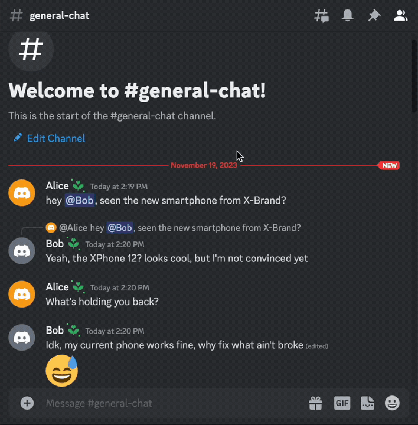

# discord-bot-tldr



Summarize conversations that you don't have time to read.

## Installation

### Prerequisites

- Python
- Discord Bot Token ([How to create a Discord Bot](https://discord.com/developers/docs/getting-started#step-1-creating-an-app))
- OpenAI API Key ([OpenAI API](https://platform.openai.com/api-keys))

### Steps

1. **Clone the Repository**:

   ```sh
   git clone https://github.com/leofdgit/discord-tldr-bot.git
   cd discord-tldr-bot
   ```

2. **Install Dependencies**:

```sh
pip install -r requirements.txt
```

3. **Setup Environment Variables**:

Edit the .env file in the project directory to populate it with your Discord Bot Token and OpenAI API Key:

```makefile
AUTHORIZED_USERS=12345,67890
MAX_MESSAGES=500
MAX_MESSAGE_COMBINED_LENGTH=10000
MAX_TOKENS=200
OPENAI_MODEL=gpt-3.5-turbo
DISCORD_BOT_KEY=your_discord_bot_token
OPENAI_API_KEY=your_openai_api_key
```

## Running the bot

### With an .env file

```sh
ENV_FILE=/path/to/env/file python main.py
```

## Usage

### Commands

`/tldr <message_link> [language]`: Summarizes the conversation following the message linked. If a language is specified, the summary will be provided in that language (defaults to English). This command **must** be used in the same channel as the linked message or an error will occur.

### Examples

```
/tldr https://discord.com/channels/1234567890/0987654321/1122334455
/tldr https://discord.com/channels/1234567890/0987654321/1122334455 Spanish
```

## Caveats and Tips

1. Message Limit: the choice of API model dictates how many messages can be processed See the [models documentation](https://platform.openai.com/docs/models) for more information.
2. API Rate Limits: Be mindful of OpenAI's API [usage limits](https://platform.openai.com/account/limits).
3. Cost: GPT4 is quite expensive; at the time of writing, summarizing 200 short-ish messages incurred a cost of $0.10. GPT3.5 is much cheaper.
4. Behaviour: the summaries given are not deterministic, meaning that summarizing the same content
   twice may give two different results. The summarizies may be innacurate.
5. Privacy Considerations: Ensure users in your Discord server are aware that their messages may be processed by this bot, and hence OpenAI, for summarization.
