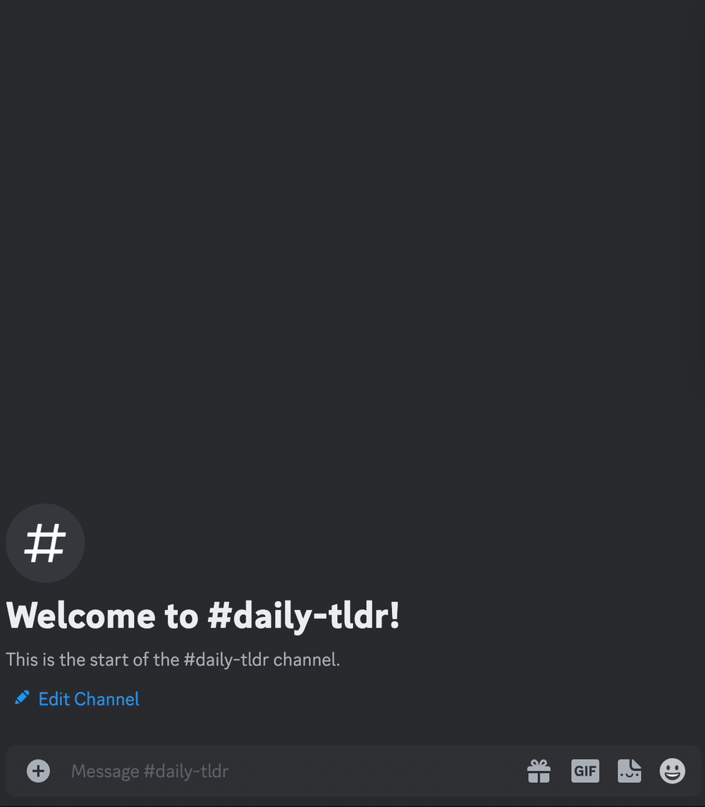

# discord-bot-tldr

Summarize conversations that you don't have time to read.

## Installation

### Prerequisites

- Python (known to work with 3.11)
- Discord Bot Token ([How to create a Discord Bot](https://discord.com/developers/docs/getting-started#step-1-creating-an-app))
- OpenAI API Key ([OpenAI API](https://platform.openai.com/api-keys))

### Steps

1. **Clone the Repository**:

   ```sh
   git clone https://github.com/leofdgit/discord-tldr-bot.git
   cd discord-tldr-bot
   ```

2. **Install Dependencies**:

```sh
pip install -r requirements.txt
```

3. **Setup Environment Variables**:

Edit the .env file in the project directory to populate it with your Discord Bot Token and OpenAI API Key:

```makefile
AUTHORIZED_USER_IDS=12345,67890
DISCORD_CLIENT_KEY=change-me
GUILD_ID=change-me
SUMMARY_MSG_LOWER_LIMIT=5
SUMMARY_OUTPUT_CHANNEL_ID=change-me
SUMMARY_INTERVAL=86400
SUMMARY_AUTOSTART=false
MAX_OUTPUT_TOKENS=200
AI_PROVIDER=open_ai
AI_MODEL=gpt-3.5-turbo
AI_API_KEY=change-me
```

## Running the bot

### With an .env file

```sh
ENV_FILE=/path/to/env/file python start.py
```

## Usage

### Commands


`/tldr <message_link>`: Summarizes the conversation following the message linked.

```
/tldr https://discord.com/channels/1234567890/0987654321/1122334455
```

### Daily Summaries



The bot will also produce daily summaries of server messages, outputting results to a specified channel. The ID of the channel must be provided in the SUMMARY_OUTPUT_CHANNEL_ID environment variable.

## Caveats and Tips

1. API Rate Limits: Be mindful of OpenAI's API [usage limits](https://platform.openai.com/account/limits).
2. Cost: GPT4 is quite expensive; at the time of writing, summarizing 200 short-ish messages incurred a cost of $0.10. GPT3.5 is much cheaper.
3. Behaviour: the summaries given are not deterministic, meaning that summarizing the same content
   twice may give two different results. The summarizies may be innacurate.
4. Privacy Considerations: Ensure users in your Discord server are aware that their messages may be processed by this bot, and hence OpenAI, for summarization.
